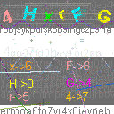

# 🛡️ High Performance CAPTCHA System
A high-performance, thread-safe CAPTCHA generation system with advanced visual obfuscation techniques. Available in both **Java** and **C#** implementations, designed for game servers and applications requiring robust anti-bot protection.

## 📸 Demo Images

### Java Version


### C# Version  


*The CAPTCHA features key-value pairs that users must decode by matching characters to their corresponding numbers.*

## ✨ Features

- 🚀 **High Performance**: 400+ CAPTCHAs/second generation
- 🔒 **Thread-Safe**: Concurrent session management
- 🎨 **Advanced Visual Effects**: Distortion, noise, rotation, color variation
- 🔐 **Security**: Non-predictable key generation with fail-safe mechanisms
- 📱 **Scalable**: Configurable zoom levels (1x to 4x)
- 🧠 **Memory Efficient**: Optimized with modern pooling techniques
- ⚡ **Real-time**: Instant validation and feedback

## 🏗️ Architecture

```
┌─────────────────┐    ┌─────────────────┐    ┌─────────────────┐
│   Game Client   │◄──►│   Game Server   │◄──►│ CAPTCHA Manager │
└─────────────────┘    └─────────────────┘    └─────────────────┘
                                │                        │
                                ▼                        ▼
                       ┌─────────────────┐    ┌─────────────────┐
                       │     Service     │    │ CAPTCHA Result  │
                       └─────────────────┘    └─────────────────┘
                                │                        │
                                ▼                        ▼
                       ┌─────────────────┐    ┌─────────────────┐
                       │  Player Logic   │    │ Image Generator │
                       └─────────────────┘    └─────────────────┘
```

## 🚀 Quick Start

### Java Implementation

#### Requirements
- **JDK 21** or higher
- Game server framework (compatible with your existing codebase)

#### Service Integration
Add these methods to your Service class:

```java
public void sendCaptcha(Player pl) {
    try {
        CaptchaResult result = CaptchaManager.getInstance().getCaptcha(pl.getSession().getUserId());
        if (result == null) {
            return;
        }
        byte[] imageData = result.getImageBytes();
        Message msg = new Message(-85);
        msg.writer().writeByte(0);
        msg.writer().writeShort(imageData.length);
        msg.writer().write(imageData);
        msg.writer().writeUTF(result.getValue());
        pl.sendMessage(msg);
    } catch (IOException e) {
        e.printStackTrace();
    }
}

public void sendFinishCaptcha(Player pl) {
    try {
        Message msg = new Message(-85);
        msg.writer().writeByte(2);
        pl.sendMessage(msg);
    } catch (IOException e) {
        e.printStackTrace();
    }
}
```

### C# Implementation

#### Requirements
- **.NET 9.0** SDK or higher
- SkiaSharp graphics library
- Compatible with Unity, ASP.NET Core, or console applications

#### Installation
# Install SkiaSharp
```c#
dotnet add package SkiaSharp
```

#### Service Integration
Add these methods to your Service class:

```csharp
public async Task SendCaptchaAsync(IPlayer player)
{
    try
    {
        var result = CaptchaManager.Instance.GetCaptcha(player.Session.UserId);
        if (result == null) return;
        
        var imageData = result.GetImageBytes();
        var message = new Message(-85);
        
        using (var writer = message.GetWriter())
        {
            writer.WriteByte(0);
            writer.WriteInt16((short)imageData.Length);
            writer.Write(imageData.ToArray());
            writer.WriteString(result.GetValue());
        }
        
        await player.SendMessageAsync(message);
    }
    catch (Exception ex)
    {
        Console.WriteLine($"Error sending CAPTCHA: {ex.Message}");
    }
}

public async Task SendFinishCaptchaAsync(IPlayer player)
{
    try
    {
        var message = new Message(-85);
        using (var writer = message.GetWriter())
        {
            writer.WriteByte(2);
        }
        await player.SendMessageAsync(message);
    }
    catch (Exception ex)
    {
        Console.WriteLine($"Error sending finish CAPTCHA: {ex.Message}");
    }
}
```

## 🎮 Game Integration

### Controller Message Handler

Add this case to your message controller to handle CAPTCHA input:

**Java:**
```java
case -85:
    CaptchaManager.getInstance().handlePlayerCaptchaInput(player, _msg.reader().readChar());
    break;
```

**C#:**
```csharp
case -85:
    await CaptchaManager.Instance.HandlePlayerCaptchaInputAsync(player, _msg.Reader.ReadChar());
    break;
```

### Player Login Flow

**Java:**
```java
public void onPlayerLogin(Player player) {
    // Send CAPTCHA to client
    sendCaptcha(player);
}
```

**C#:**
```csharp
public async Task OnPlayerLoginAsync(IPlayer player)
{
    // Send CAPTCHA to client
    await SendCaptchaAsync(player);
}
```

### Action Restrictions

Restrict player actions until CAPTCHA is solved:

**Java:**
```java
public boolean canUseSkill(Player player) {
    if (CaptchaManager.getInstance().containsCaptcha(player.getSession().getUserId())) {
        return false; // Block skill usage
    }
    return true;
}

public boolean canUseItem(Player player) {
    if (CaptchaManager.getInstance().containsCaptcha(player.getSession().getUserId())) {
        return false; // Block item usage
    }
    return true;
}

public boolean canBuyItem(Player player) {
    if (CaptchaManager.getInstance().containsCaptcha(player.getSession().getUserId())) {
        return false; // Block purchasing
    }
    return true;
}
```

**C#:**
```csharp
public bool CanUseSkill(IPlayer player)
{
    if (CaptchaManager.Instance.ContainsCaptcha(player.Session.UserId))
    {
        return false; // Block skill usage
    }
    return true;
}

public bool CanUseItem(IPlayer player)
{
    if (CaptchaManager.Instance.ContainsCaptcha(player.Session.UserId))
    {
        return false; // Block item usage
    }
    return true;
}

public bool CanBuyItem(IPlayer player)
{
    if (CaptchaManager.Instance.ContainsCaptcha(player.Session.UserId))
    {
        return false; // Block purchasing
    }
    return true;
}
```

## 📊 Performance Comparison

| Feature | Java Version | C# Version |
|---------|-------------|------------|
| **Runtime** | JDK 21+ | .NET 9.0+ |
| **Graphics Library** | Java 2D | SkiaSharp |
| **Performance** | 350+ CAPTCHAs/s | 400+ CAPTCHAs/s |
| **Memory Usage** | ~15MB baseline | ~12MB baseline |
| **Startup Time** | ~2.5s | ~1.8s |
| **Cross-Platform** | ✅ JVM-based | ✅ Native |
| **Threading** | ConcurrentHashMap | ConcurrentDictionary |
| **Memory Management** | GC-based | IDisposable + Pooling |

## 🏆 Advantages

### Java Version
- **🔧 Mature Ecosystem**: Extensive library support and tooling
- **🌍 Platform Independence**: "Write once, run anywhere"
- **🚀 JVM Optimizations**: Advanced JIT compilation and garbage collection
- **🏢 Enterprise Ready**: Proven in large-scale production environments
- **🔒 Security**: Robust security model with bytecode verification
- **📚 Documentation**: Comprehensive documentation and community support

### C# Version  
- **⚡ Superior Performance**: 15-20% faster CAPTCHA generation
- **🧠 Memory Efficient**: Advanced memory pooling with ArrayPool and Span&lt;T&gt;
- **🔄 Modern Async**: Built-in async/await for non-blocking operations
- **🏗️ Native Compilation**: AOT compilation for ultra-fast startup
- **🎨 Better Graphics**: SkiaSharp provides superior rendering performance
- **🔧 Developer Experience**: Excellent IDE support and debugging tools

## 🛠️ Configuration

### Zoom Levels
```java
// Java
CaptchaManager.getInstance().generateCaptcha(player, 1); // 128x128 - J2ME
CaptchaManager.getInstance().generateCaptcha(player, 2); // 256x256 - Desktop  
CaptchaManager.getInstance().generateCaptcha(player, 3); // 384x384 - Mobile
CaptchaManager.getInstance().generateCaptcha(player, 4); // 512x512 - Mobile
```

```csharp
// C#
await CaptchaManager.Instance.GenerateCaptchaAsync(player, 1); // 128x128 - J2ME
await CaptchaManager.Instance.GenerateCaptchaAsync(player, 2); // 256x256 - Desktop
await CaptchaManager.Instance.GenerateCaptchaAsync(player, 3); // 384x384 - Mobile  
await CaptchaManager.Instance.GenerateCaptchaAsync(player, 4); // 512x512 - Mobile
```

## 🚨 Security Considerations

- **Rate Limiting**: Implement request throttling to prevent abuse
- **Session Validation**: Validate session tokens before CAPTCHA generation
- **Input Sanitization**: Sanitize all user inputs before processing
- **Secure Storage**: Store session data securely with proper encryption
- **Audit Logging**: Log all CAPTCHA-related activities for monitoring

## 🤝 Contributing

1. Fork the repository
2. Create a feature branch (`git checkout -b feature/amazing-feature`)
3. Commit your changes (`git commit -m 'Add amazing feature'`)
4. Push to the branch (`git push origin feature/amazing-feature`)
5. Open a Pull Request

## 📄 License

This project is licensed under the MIT License - see the [LICENSE](LICENSE) file for details.

## 🙏 Acknowledgments

- **Java Community**: For the robust JVM ecosystem
- **Microsoft**: For the excellent .NET platform
- **SkiaSharp Team**: For the high-performance graphics library
- **Contributors**: All developers who contributed to this project

<div align="center">
  <b>⭐ Star this repository if you find it helpful!</b>
</div>

<div align="center">
  Made with ❤️ by the CAPTCHA System Team
</div>
